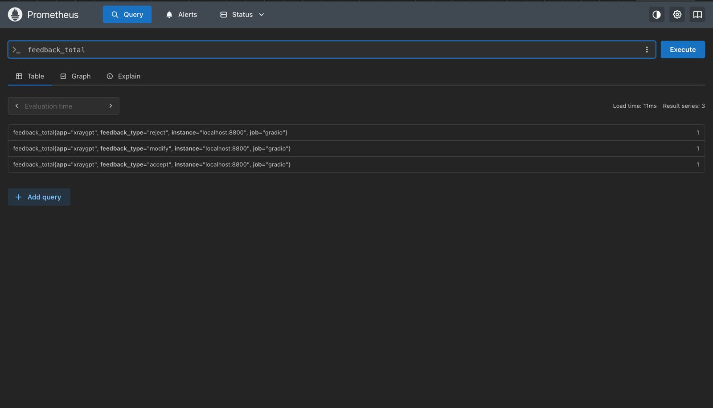
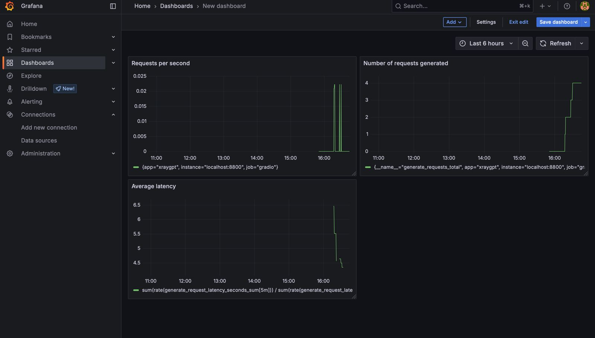
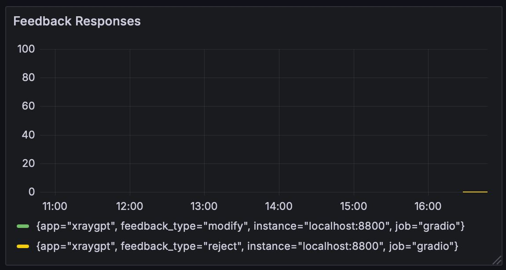
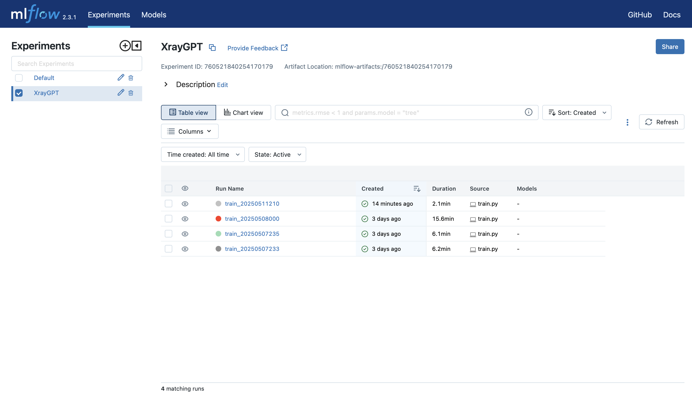
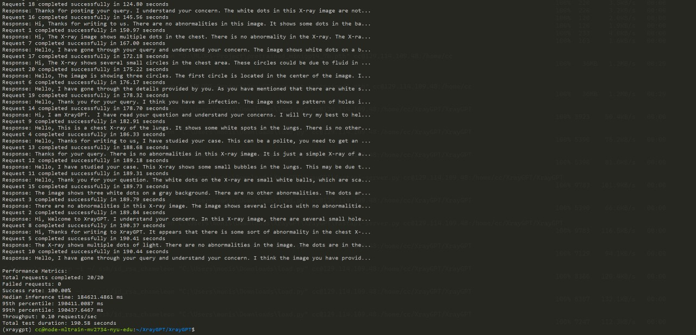
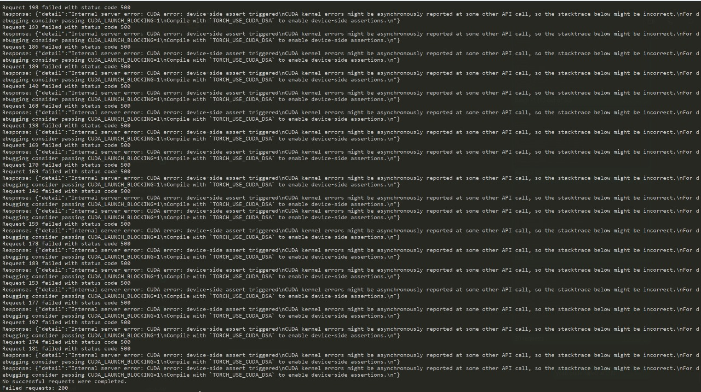

# XrayGPT-Chest-Radiographs-Summariser

### Value Proposition

XrayGPT-CloudMed is an AI-powered chest radiograph analysis system designed to assist radiologists by automatically summarizing X-ray findings and providing interactive diagnostic assistance. The current workflow in radiology involves manual interpretation and report writing, which is **time-consuming, prone to variability, and susceptible to human error**. Our system uses **XrayGPT**, a vision-language model fine-tuned for medical imaging, to generate structured summaries and answer queries in real-time, improving diagnostic consistency and reducing workload.

Misclassifying sensitive data is an ethics concern and there is a possibilty that our system will make mistakes. To mitigate this risk and inform the radiologists, we will attach a confidence score along with the output to give an idea about the quality of the prediction and use their discretion to make an informed decision. 

#### Non-ML Status Quo:
In target hospitals, the current workflow involves:
Manual Interpretation: General practitioners or junior radiologists draft preliminary reports, often lacking specialized expertise.
Outsourcing: Hospitals send X-rays to third-party radiology services, incurring delays (6–24 hours) and high costs (50–50–150 per study).
Inefficient Triage: Critical cases (e.g., collapsed lungs) may not be flagged promptly, risking patient outcomes.

#### Business Metric:
Reduction in average report turnaround time (from image acquisition to preliminary report delivery).
Baseline: 8–12 hours (due to outsourcing or backlog).
Target with XrayGPT: ≤30 minutes.
Measurement: Track time stamps from image upload to report generation in the hospital’s EHR system.

---
### Contributors

| Name                            | Responsible for | Link to their commits in this repo |
|---------------------------------|-----------------|------------------------------------|
| All team members                | System Design, DevOps, CI/CD & Monitoring, Deployment | [All commits](https://github.com/ShreyasBhaktharam/XrayGPT-Chest-Radiographs-Summariser/commits/master/) |
| Monish Raman Vishakraman                   | Model serving and optimization | [Monish's commits]() |
| Shreyas Bhaktharam                   | Data Pipeline & Infrastructure setup | [Shreyas's commits](https://github.com/ShreyasBhaktharam/XrayGPT-Chest-Radiographs-Summariser/commits?author=ShreyasBhaktharam) |
| Rohan Dhengale                   | Model Development & Training | [Rohan's commits]() |

---
### System Diagram


---
### Summary of Outside Materials

| Name              | How it was created | Conditions of use |
|------------------|--------------------|-------------------|
| [MIMIC-CXR Dataset](https://www.physionet.org/content/mimic-cxr-jpg/2.1.0/)  | Collected from real-world radiology reports, de-identified | Public, research use (PhysioNet license) |
| [OpenI Dataset](https://openi.nlm.nih.gov)     | Chest X-rays from Indiana University hospital network | Public, research use (NIH license) |
| MedClip (Vision Encoder) | Pretrained model for medical images | Open-source, research use |
| Vicuna (LLM)      | Fine-tuned LLaMA model for dialogue tasks | Open-source, non-commercial use |

---
### Summary of Infrastructure Requirements

| Requirement     | How many/when                                     | Justification |
|-----------------|---------------------------------------------------|---------------|
| `m1.large` VMs | 3 for entire project duration                     | Manage training, and monitoring services |
| `gpu_mi100`     | 4-hour block twice a week                         | Distributed model training |
| Floating IPs    | 1 for entire project duration, 1 for sporadic use | API hosting and testing |
| Persistent Storage | 1TB for project duration                      | Store datasets, models, and logs |
| `gpu_a10` | 2 for entire project duration | Vision-language models require GPU acceleration for real-time clinical use

---
### Detailed Design Plan

#### Model Training and Training Platforms

- **Components:** Uses **MedClip for vision encoding**, **Vicuna for text generation**, and a **linear transformation layer** for modality alignment.
- **Justification:** XrayGPT requires domain-specific adaptation; fine-tuning on **217k radiology reports** enhances its performance.
- **Lecture Relevance:** Implements **DDP/FSDP** for large-scale training and **Ray Tune** for hyperparameter tuning.
- **Difficulty Points:** Train multiple models and leveraging **multi-GPU scaling** and **automated re-training**.

#### Model Serving and Monitoring Platforms

- **Strategy:** Deploy model as a **FastAPI service** with **ONNX optimizations** for low-latency inference.
- **Components:** Uses **Kubernetes for scaling**, **Grafana for monitoring**, and **Prometheus for logging**.
- **Justification:** Ensures **high availability** and **low response times** for clinical use.
- **Lecture Relevance:** Implements **quantization, tensor optimizations**, and **multi-model inference handling**.
- **Difficulty Points:** Leverages specialised GPUs for inference to enable real-time feedback.

#### Data Pipeline

- **Strategy:** **ETL pipeline** processes **raw radiology reports** into structured summaries.
- **Components:** Uses **Kafka for real-time ingestion**, **Apache Spark for processing**, and **PostgreSQL for storage**.
- **Justification:** Ensures high-quality data for model retraining and evaluation.
- **Lecture Relevance:** Implements **data validation, storage management, and streaming analytics**.
- **Difficulty Points:** Includes **real-time data simulation** and **interactive data dashboards** using Grafana.

#### Continuous X (CI/CD, Training, Deployment)

- **Strategy:** **GitOps-driven CI/CD pipeline** for **automated retraining, testing, and deployment**.
- **Components:** Uses **GitHub Actions, Argo Workflows, Terraform, and Helm**.
- **Justification:** Ensures **reproducible, automated infrastructure**.
- **Lecture Relevance:** Implements **immutable infrastructure principles and microservices deployment**.

---
### Steps to run

Bring up the infrastructure using these commands:
```
terraform plan
terraform apply
```

After that, run the ansible playbook with this command:
```
ansible-playbook -i inventory.ini xraygpt-deploy.yml
```

### Different dashboards and training runs

#### Prometheus

#### Grafana


#### Mlflow

#### FastAPI inference latency


